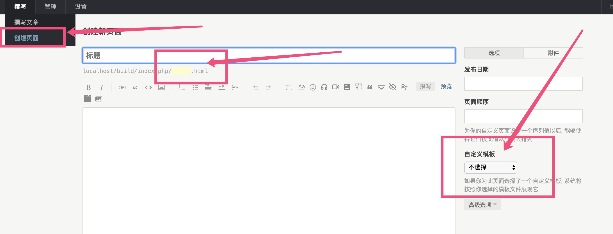

主题内置了**五套自定义模板** `时光机`、`文章归档`、`友情链接`和`留言板`和`豆瓣书单`。

### 使用方法


 
在后台了**撰写——创建页面**的右下角的`自定义模板`选择相应的自定义模板即可。下面简单介绍自定义模板的使用方法。

### 时光机

!> 关注微信公众号`ihewro（我要起飞啦熬）`按照[微信公众号发送时光机](/wechat) 即可通过微信公众号同步发送到handsome主题的博客中

* 填写地址的时候，**必须**填写为 <span style="color: rgb(255, 255, 255); background-color: rgb(250, 192, 143);">cross</span>.html（是地址，不是标题！！！标题随便写，但是地址要固定的，否则首页无法读取内容）

* 外观设置——初级设置——首页左侧边栏头像的链接地址 默认是时光机页面的地址，你可以修改
* 内容框里面不用填任何东西，这个页面在**前台**（就是直接打开这个独立页面，然后在登录的状态下）就可以发布“说说”，用来记录你的日常和心情的~

**看不到输入框**：请确保你已经登录了，并且该独立页面允许评论（只有管理员登录后才会显示输入框，游客是看不见的，请放心）

**如何删除说说：**在后台的评论管理中删掉该页面的对应评论即可。

**说说不能发表图片**： 见[常见问题](common-problem?id=%e8%af%84%e8%ae%ba%e5%8c%ba%e4%b8%8d%e8%83%bd%e6%96%97%e5%9b%be%e4%b8%8d%e8%83%bd%e6%98%be%e7%a4%ba%e5%9b%be%e7%89%87%e8%af%b4%e8%af%b4%e4%b8%8d%e8%83%bd%e6%98%be%e7%a4%ba%e5%9b%be%e7%89%87)

### 文章归档

* 地址随意填写。

* 内容框不用填任何内容。这个页面会自动把你所有文章以时间树的形式显示出来。

### 友情链接

* 地址随意填写。

* 这个页面自动输出`links`插件里面设置的友情链接。（具体用法见**插件设置**）友情链接页面的`本博信息`在独立页面的输入框中填写即可，会和链接一起输出。

### 留言板

* 地址随意填写。

* 这个页面会自动输出评论数最多的前15名。如果需要填写自定义内容在输出框中填写即可，会一起输出。

### 豆瓣清单

* 地址随意填写。

* 这个页面会自动输出你的豆瓣书单（`已读的书`）、电影清单（`已看的电影`）。

* 在自定义字段中填写：名称为`doubanID`,值为`你的豆瓣ID`。访问该网址以检查的ID是否正确：<https://www.douban.com/people/你的豆瓣ID/>，填写的是豆瓣ID，不是整个url地址

* 因为需要写入缓存文件，请确保你的主题下的`aseets/cache`目录可写

* 请确保的你的豆瓣有`已看的电影`和`已读的书`的数据，不然会显示错误。

* 图书数据不能显示，一直显示“数据已添加成功，请刷新一次”，刷新了还是显示不了的话，一般是全站静态缓存了，请修改你的cdn缓存策略，不要全站静态缓存，缓存静态资源（.jpg  .css  .js）之类文件即可 


![3.jpg][2]


### github项目

* 地址随意填写
* 这个页面会输出你所想要输出的github项目名称

你有两种方式显示你的github项目：

##### 输出所有的你的github项目

!> 受限制与github提供的api限制，你只能显示30个你的github项目清单

* 在自定义字段中填写：名称为`github`，值为你的`github用户名`

##### 自定义输出项目（待开发，暂不能使用）

在编辑器中按照下面的格式填写：

```
[github="用户名/仓库名"] 
//举例：
[github="ihewro/typecho-theme-leaf"] 
```


